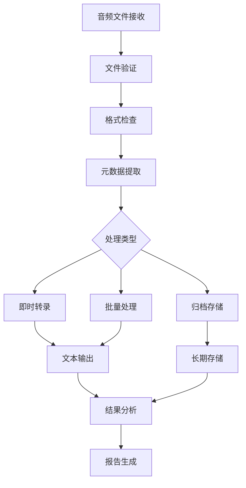

# 音频处理工作流

## 概述
本文档定义了OpenClaw系统中的音频处理工作流，包括文件管理、转录、分析和归档。

## 工作流架构



## 阶段1: 文件接收与验证

### 1.1 接收目录
- **路径**: `/home/goose/.openclaw/media/inbound/`
- **监控**: 实时监控新文件
- **格式**: Ogg/Opus, MP3, WAV, M4A

### 1.2 验证步骤
```bash
# 检查文件完整性
./scripts/audio_file_manager.sh info <文件名>

# 验证音频格式
file <音频文件>
```

### 1.3 自动验证脚本
```bash
#!/bin/bash
# auto_validate.sh
AUDIO_DIR="/home/goose/.openclaw/media/inbound"

# 监控新文件
inotifywait -m -e create "$AUDIO_DIR" | while read path action file; do
    if [[ "$file" =~ \.(ogg|mp3|wav|m4a)$ ]]; then
        echo "新音频文件: $file"
        ./scripts/audio_file_manager.sh info "$file"
    fi
done
```

## 阶段2: 预处理

### 2.1 格式标准化
```bash
# 转换为标准格式（如果需要）
ffmpeg -i input.ogg -acodec pcm_s16le -ar 16000 output.wav
```

### 2.2 质量检查
- 采样率: ≥16kHz
- 声道: 单声道（推荐）
- 比特率: ≥64kbps
- 时长: ≤30分钟（长音频分段）

### 2.3 元数据提取
```json
{
  "filename": "audio_20240228.ogg",
  "size_bytes": 134000,
  "duration_seconds": 45.2,
  "sample_rate": 48000,
  "channels": 1,
  "format": "Ogg/Opus",
  "received_at": "2024-02-28T09:28:00Z",
  "source": "telegram_webchat"
}
```

## 阶段3: 处理引擎

### 3.1 转录服务选择

| 服务 | 优点 | 缺点 | 适用场景 |
|------|------|------|----------|
| **本地Whisper** | 隐私好，离线可用 | 需要GPU/CPU资源 | 敏感内容，批量处理 |
| **Inference.sh** | 高质量，多语言 | 需要网络，API调用 | 实时转录，高精度 |
| **Google STT** | 准确度高 | 需要API密钥，网络 | 商业用途，多语言 |
| **AssemblyAI** | 说话人分离 | 付费服务 | 会议记录，访谈 |

### 3.2 转录配置

#### 中文转录配置
```python
# config/transcribe_chinese.json
{
  "model": "whisper-large-v3",
  "language": "zh",
  "task": "transcribe",
  "temperature": 0.0,
  "initial_prompt": "这是中文对话内容",
  "word_timestamps": true,
  "vad_filter": true
}
```

#### 英文翻译配置
```python
# config/translate_english.json
{
  "model": "whisper-large-v3",
  "language": "zh",
  "task": "translate",
  "temperature": 0.0,
  "best_of": 5,
  "beam_size": 5
}
```

### 3.3 处理脚本

#### 即时处理脚本
```bash
#!/bin/bash
# process_immediate.sh
AUDIO_FILE="$1"
OUTPUT_DIR="./transcriptions/$(date +%Y%m%d)"

mkdir -p "$OUTPUT_DIR"

# 中文转录
whisper "$AUDIO_FILE" \
  --model large-v3 \
  --language zh \
  --output_dir "$OUTPUT_DIR" \
  --output_format json

# 英文翻译
whisper "$AUDIO_FILE" \
  --model large-v3 \
  --task translate \
  --output_dir "$OUTPUT_DIR" \
  --output_format txt
```

#### 批量处理脚本
```bash
#!/bin/bash
# process_batch.sh
INPUT_DIR="$1"
OUTPUT_DIR="./batch_transcriptions/$(date +%Y%m%d_%H%M%S)"

mkdir -p "$OUTPUT_DIR"

find "$INPUT_DIR" -name "*.ogg" -o -name "*.mp3" -o -name "*.wav" | while read audio_file; do
    filename=$(basename "$audio_file" | cut -d. -f1)
    
    echo "处理: $filename"
    
    # 并行处理
    whisper "$audio_file" \
      --model turbo \
      --language zh \
      --output_dir "$OUTPUT_DIR/$filename" \
      --output_format all &
done

wait
echo "批量处理完成"
```

## 阶段4: 后处理与分析

### 4.1 文本清理
```python
# scripts/clean_transcription.py
import re

def clean_transcription(text):
    # 移除多余空格
    text = re.sub(r'\s+', ' ', text)
    
    # 修复标点符号
    text = re.sub(r'([。！？；])\s*', r'\1\n', text)
    
    # 移除听不清标记
    text = re.sub(r'\[听不清\]|\[背景音\]', '', text)
    
    # 分段处理
    sentences = text.split('\n')
    cleaned = [s.strip() for s in sentences if s.strip()]
    
    return '\n'.join(cleaned)
```

### 4.2 关键词提取
```python
# scripts/extract_keywords.py
import jieba
import jieba.analyse

def extract_chinese_keywords(text, top_k=10):
    # 中文关键词提取
    keywords = jieba.analyse.extract_tags(
        text, 
        topK=top_k,
        withWeight=True,
        allowPOS=('n', 'vn', 'v', 'nr', 'ns', 'nt')
    )
    return keywords

def extract_english_keywords(text, top_k=10):
    # 英文关键词提取（使用nltk或spacy）
    from collections import Counter
    import re
    
    words = re.findall(r'\b[a-zA-Z]{3,}\b', text.lower())
    word_counts = Counter(words)
    return word_counts.most_common(top_k)
```

### 4.3 情感分析
```python
# scripts/sentiment_analysis.py
from textblob import TextBlob

def analyze_sentiment(text, language='en'):
    if language == 'zh':
        # 中文情感分析（需要翻译或使用中文模型）
        translated = translate_to_english(text)
        blob = TextBlob(translated)
    else:
        blob = TextBlob(text)
    
    return {
        'polarity': blob.sentiment.polarity,  # -1到1
        'subjectivity': blob.sentiment.subjectivity,  # 0到1
        'assessment': 'positive' if blob.sentiment.polarity > 0.1 else 
                     'negative' if blob.sentiment.polarity < -0.1 else 
                     'neutral'
    }
```

## 阶段5: 存储与归档

### 5.1 文件结构
```
audio_archive/
├── 2024/
│   ├── 02/
│   │   ├── 28/
│   │   │   ├── raw/          # 原始音频
│   │   │   ├── transcribed/  # 转录文本
│   │   │   ├── processed/    # 处理结果
│   │   │   └── metadata/     # 元数据
│   │   └── 29/
└── index.json               # 索引文件
```

### 5.2 数据库存储
```sql
-- audio_transcriptions 表结构
CREATE TABLE audio_transcriptions (
    id UUID PRIMARY KEY,
    filename VARCHAR(255),
    file_path TEXT,
    file_size INTEGER,
    duration_seconds FLOAT,
    language VARCHAR(10),
    transcription_text TEXT,
    translation_text TEXT,
    keywords JSONB,
    sentiment JSONB,
    processed_at TIMESTAMP,
    source VARCHAR(50)
);

-- 创建索引
CREATE INDEX idx_processed_at ON audio_transcriptions(processed_at);
CREATE INDEX idx_language ON audio_transcriptions(language);
CREATE INDEX idx_keywords ON audio_transcriptions USING GIN(keywords);
```

### 5.3 备份策略
```bash
#!/bin/bash
# backup_audio_data.sh
BACKUP_DIR="/backup/audio_data"
SOURCE_DIR="/home/goose/.openclaw/workspace/audio_archive"

# 每日增量备份
rsync -av --delete \
  --backup --backup-dir="$BACKUP_DIR/incremental/$(date +%Y%m%d)" \
  "$SOURCE_DIR/" "$BACKUP_DIR/latest/"

# 每周全量备份（周日）
if [ $(date +%u) -eq 7 ]; then
    tar -czf "$BACKUP_DIR/full/audio_archive_$(date +%Y%m%d).tar.gz" "$SOURCE_DIR"
fi

# 保留策略
find "$BACKUP_DIR/incremental" -type d -mtime +30 -exec rm -rf {} \;
find "$BACKUP_DIR/full" -name "*.tar.gz" -mtime +90 -delete;
```

## 阶段6: 报告与监控

### 6.1 处理报告
```python
# scripts/generate_report.py
def generate_daily_report(date):
    """生成每日处理报告"""
    report = {
        'date': date,
        'summary': {
            'files_processed': 0,
            'total_duration': 0,
            'languages': {},
            'success_rate': 1.0
        },
        'files': [],
        'issues': [],
        'recommendations': []
    }
    
    # 收集数据
    # ...
    
    return report
```

### 6.2 监控面板
```bash
#!/bin/bash
# monitoring_dashboard.sh
echo "=== 音频处理系统监控 ==="
echo "时间: $(date)"
echo ""

# 系统状态
echo "📊 系统状态:"
echo "- 音频目录: $(du -sh /home/goose/.openclaw/media/inbound | cut -f1)"
echo "- 待处理文件: $(find /home/goose/.openclaw/media/inbound -name "*.ogg" -o -name "*.mp3" | wc -l)"
echo "- 今日处理: $(find /home/goose/.openclaw/workspace/audio_archive -type f -name "*.json" -mtime -1 | wc -l)"
echo ""

# 服务状态
echo "🔧 服务状态:"
if command -v whisper &> /dev/null; then
    echo "- Whisper: ✅ 可用"
else
    echo "- Whisper: ❌ 不可用"
fi

if command -v ffmpeg &> /dev/null; then
    echo "- FFmpeg: ✅ 可用"
else
    echo "- FFmpeg: ❌ 不可用"
fi
echo ""

# 最近活动
echo "📈 最近活动:"
tail -5 /home/goose/.openclaw/workspace/logs/audio_management.log
```

## 自动化工作流

### 完整工作流脚本
```bash
#!/bin/bash
# audio_workflow_complete.sh
set -e

# 配置
AUDIO_DIR="/home/goose/.openclaw/media/inbound"
WORKSPACE_DIR="/home/goose/.openclaw/workspace"
LOG_FILE="$WORKSPACE_DIR/logs/workflow_$(date +%Y%m%d).log"

# 日志函数
log() {
    echo "[$(date '+%Y-%m-%d %H:%M:%S')] $1" | tee -a "$LOG_FILE"
}

# 步骤1: 检查新文件
log "步骤1: 检查新音频文件"
NEW_FILES=$(find "$AUDIO_DIR" -name "*.ogg" -mmin -5)

if [ -z "$NEW_FILES" ]; then
    log "没有新文件，退出"
    exit 0
fi

# 步骤2: 验证文件
log "步骤2: 验证文件"
for file in $NEW_FILES; do
    ./scripts/audio_file_manager.sh info "$(basename "$file")"
done

# 步骤3: 处理文件
log "步骤3: 处理文件"
for file in $NEW_FILES; do
    filename=$(basename "$file")
    log "处理文件: $filename"
    
    # 转录
    whisper "$file" \
      --model turbo \
      --language zh \
      --output_dir "$WORKSPACE_DIR/transcriptions" \
      --output_format json
    
    # 归档
    ./scripts/audio_file_manager.sh archive "$filename"
done

# 步骤4: 生成报告
log "步骤4: 生成报告"
./scripts/audio_file_manager.sh report

log "工作流执行完成"
```

## 故障排除

### 常见问题
1. **音频格式不支持**
   - 解决方案: 使用ffmpeg转换格式
   ```bash
   ffmpeg -i input.m4a -acodec libvorbis output.ogg
   ```

2. **转录质量差**
   - 检查音频质量（背景噪音、音量）
   - 尝试不同模型（turbo → large-v3）
   - 添加initial_prompt提供上下文

3. **处理速度慢**
   - 使用GPU加速
   - 批量处理而非实时
   - 使用faster-whisper

4. **存储空间不足**
   - 定期清理旧文件
   - 压缩归档文件
   - 使用外部存储

### 监控指标
- 文件处理成功率 ≥95%
- 平均处理时间 ≤音频时长的2倍
- 存储使用率 ≤80%
- 错误率 ≤5%

## 扩展与集成

### 与OpenClaw集成
```javascript
// OpenClaw插件
module.exports = {
  name: 'audio-processor',
  description: '音频处理工作流',
  
  hooks: {
    'message:audio': async (message) => {
      // 自动处理音频消息
      const audioPath = message.media.path;
      const result = await processAudio(audioPath);
      
      return {
        transcription: result.text,
        translation: result.translation,
        keywords: result.keywords
      };
    }
  }
};
```

### API端点
```python
# api/audio.py
from fastapi import FastAPI, File, UploadFile
from whisper import transcribe_audio

app = FastAPI()

@app.post("/api/audio/transcribe")
async def transcribe_audio_endpoint(
    file: UploadFile = File(...),
    language: str = "auto",
    translate: bool = False
):
    """音频转录API"""
    # 保存上传文件
    temp_path = f"/tmp/{file.filename}"
    with open(temp_path, "wb") as f:
        f.write(await file.read())
    
    # 处理音频
    result = transcribe_audio(temp_path, language, translate)
    
    return {
        "success": True,
        "filename": file.filename,
        "text": result["text"],
        "language": result["language"],
        "duration": result["duration"]
    }
```

## 维护计划

### 每日任务
- 检查新文件并处理
- 生成处理报告
- 清理临时文件

### 每周任务
- 备份数据
- 更新模型（如果可用）
- 检查系统健康

### 每月任务
- 审查存储策略
- 优化处理参数
- 更新文档

---

**版本**: 1.0.0  
**最后更新**: 2026-02-28  
**维护者**: OpenClaw Audio Team